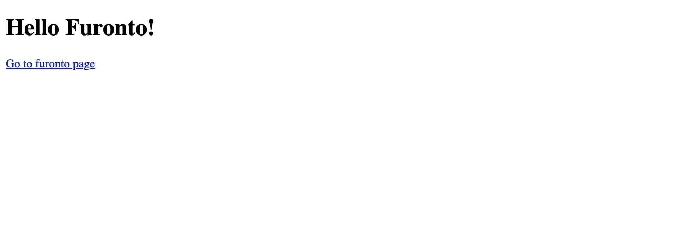

# Welcome to FurontoJS - The 1K component-based javascript library!

FurontoJS is a minimalistic front-end library that runs on the browser, it is a kind of wrap around HTML that allows you to create teeny tiny components in a flash.

The only thing you need to get started is to clone this repository and then add all your code on the `src.js` file, just like that.

You can create a simple component in the following fashion:
```javascript
const Title = furonto.create('h1', { class: 'title', innerText: 'Hello Furonto!'})
furonto.registerComponent(Title);
```


You can have a more complicated approach like this one, with the native `div` and `link` components:

```javascript
const Title = furonto.create('h1', { class: 'title', innerText: 'Hello Furonto!'})

const LinkContainer = furonto.div({ class: 'link-container'}, 
  furonto.link({ href: 'https://github.com/64lines/furontojs', target: '_blank', innerText: 'Go to furonto page' })
)

const MainDiv = furonto.create('div', {}, 
  Title,
  LinkContainer,
);

furonto.registerComponent(MainDiv);
```


As you can see, the sky is the limit. You can combinate different components to have complicated websites or add them on different files to have a more modular design, you can also extend the FurontoJS features by editing the `furonto.js` file.

Enjoy!